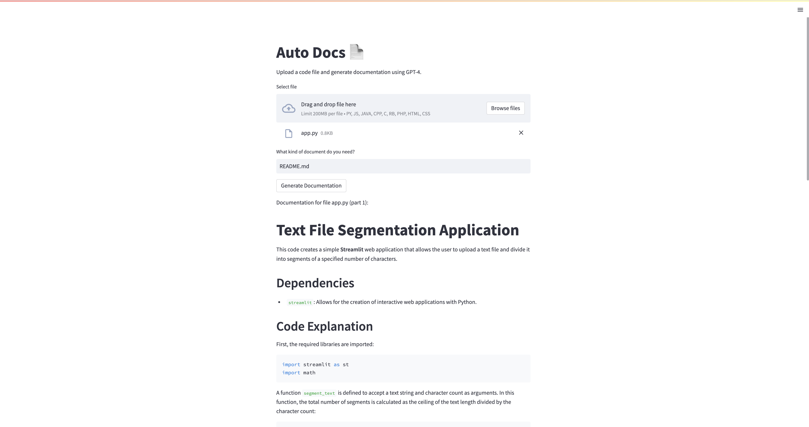
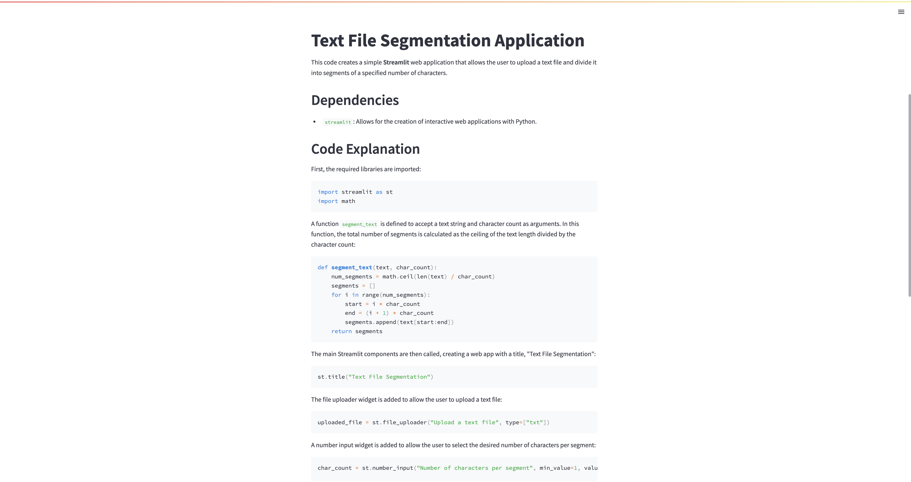

# README.md

## Auto Docs

Auto Docs is a web application that generates documentation for your code using OpenAI's GPT-4. This application is built using Streamlit and OpenAI's API.

### Dependencies

- Streamlit
- OpenAI
- python-dotenv

### Setup

1. Make sure you have installed the dependencies listed above.
2. Set your OpenAI API key in a `.env` file in the same directory as the script. The key should be set as `PRIV_KEY=your_api_key_here`.

### Usage

Run the application using the command: `streamlit run app.py`

This will start the Streamlit server and open the web application in your browser.

### How it works

1. Upload your code file (supported file types: .py, .js, .java, .cpp, .c, .rb, .php, .html, .css).
2. Enter the type of documentation you need in the text input field.
3. Click the "Generate Documentation" button to generate the documentation for your code.

The application reads the code file and breaks it into chunks if necessary (due to API limitations). It then sends the code chunks to GPT-4 to generate the requested documentation.

### Examples

### Note

The generated documentation may not always be perfect, as it relies on the quality of the input and the GPT-4 model's understanding of the code. It's a good starting point for your documentation, but you should review and edit it as needed.

